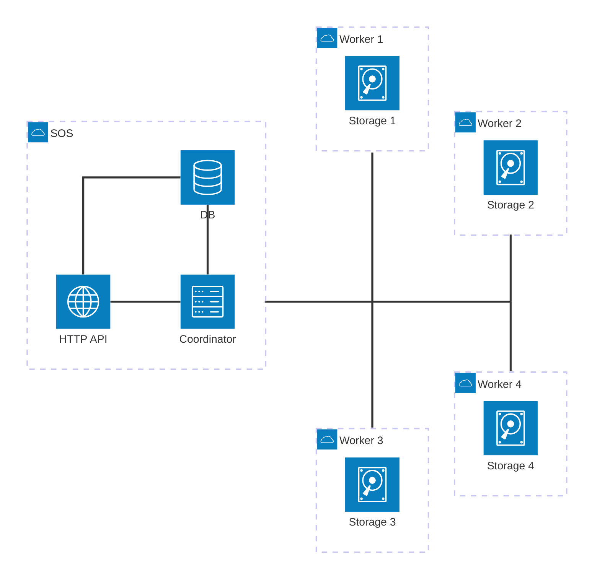

# Design

(Minimally) AWS S3 API compatible object storage.

## Supported Methods

- `CreateBucket`
- `ListBuckets`
- `DeleteBucket`
- `PutObject`
- `CopyObject`
- `ListObjectsV2`
- `GetObject`
- `DeleteObject`

## Architecture

- `HTTP API` - Partially S3-compatible API 'frontend'
- `Coordinator` - Keeps track of workers and entities. Is responsible for all operations.
- `DB` - Database where all information regarding buckets, objects, etc is stored.
- `Storage` - A worker which _actually_ stores the objects. Doesn't make decisions on its own, it waits for commands from the Coordinator.

## TBD

1. I guess we should be replicating object over all workers
2. Therefore, a distributed transaction is required here
3. And there also should be a way to somehow add another worker / restore the failed one - which would require somehow copying all the objects from one of the healthy workers (so that they are all in the same state)
4. Or maybe we should just have ONE storage worker for the sake of simplicity?
