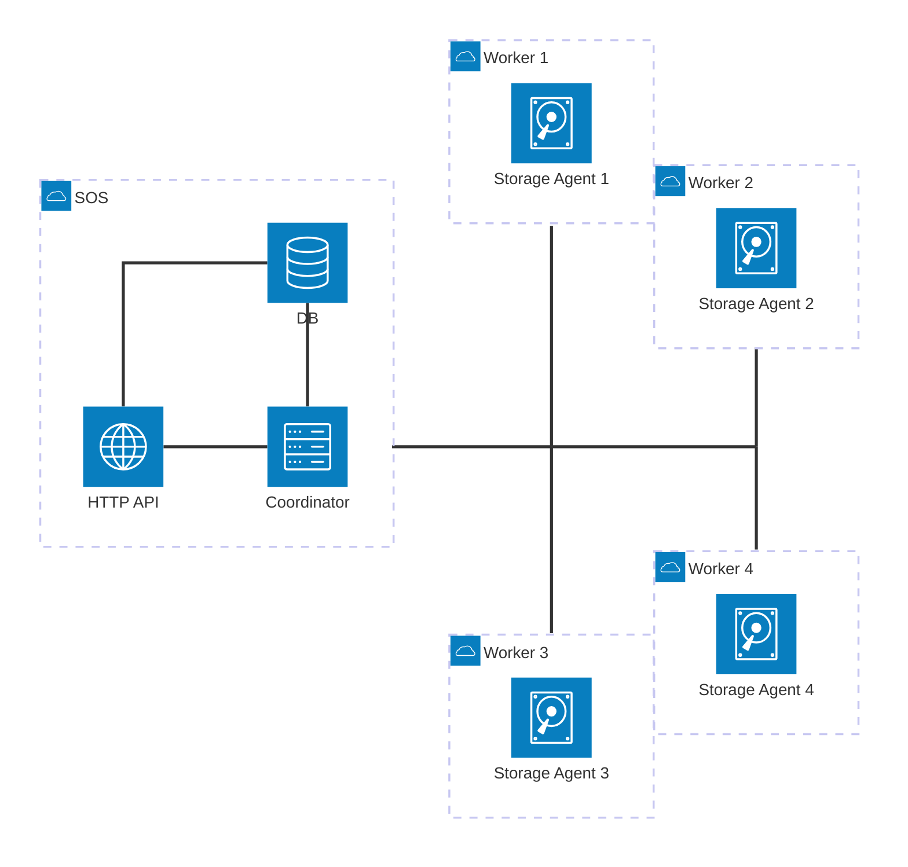
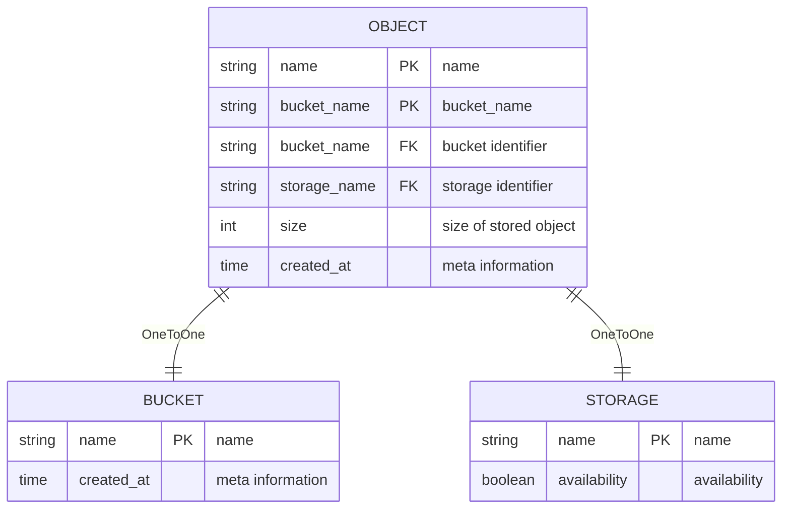

# Design

(Minimally) AWS S3 API compatible object storage.

## Supported Methods

- `CreateBucket`
- `ListBuckets`
- `DeleteBucket`
- `PutObject`
- `CopyObject`
- `ListObjectsV2`
- `GetObject`
- `DeleteObject`

## Architecture

Database diagrams  

- `HTTP API` - Partially S3-compatible API 'frontend'
- `Coordinator` - Keeps track of workers and entities. Is responsible for all operations.
- `DB` - Database where all information regarding buckets, objects, etc is stored.
- `Storage` - A worker which _actually_ stores the objects. Doesn't make decisions on its own, it waits for commands from the Coordinator.
